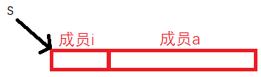
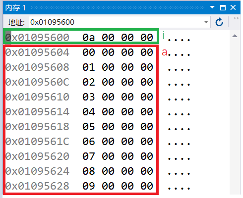

# 柔性数组

## 柔性数组定义

C99中，结构体中**最后一个元素**允许是未知大小的数组，这个成员叫做结构体的柔性数组成员。

柔型数组有两种定义方式：

```
1. typedef struct st_type
2. {
3.  int i;
4.  int a[0];//柔性数组成员
5. }type_a;
```

有些编译器会报错无法编译可以改成：

```
1. typedef struct st_type
2. {
3.  int i;
4.  int a[];//柔性数组成员
5. }type_a;
```

## 柔性数组的特点

（1）结构中的柔性数组成员 前面必须至少包含一个其他成员（从上面的代码可以看出）

（2）sizeof( )返回的这种结构大小不包括柔性数组的内存

```
1. #define  _CRT_SECURE_NO_WARNINGS  1
2. #include<stdio.h>
3. typedef struct st_type
4. {
5.  int i;
6.  int a[0];//柔性数组成员
7. }type_a;
8. 
9. int main()
10. {
11.   printf("sizeof(type_a) = %d\n", sizeof(type_a));
12.   return 0;
13. }
```

打印结果为4可以看出特点(2) : 返回的结构大小不包括柔性数组的大小


（3）包含柔型数组成员的结构用malloc( )函数进行内存的动态分配，并且分配的内存应该大于结构的大小。以适应柔型数组的预期大小。

```
1. #define  _CRT_SECURE_NO_WARNINGS  1
2. #include<stdio.h>
3. #include<stdlib.h>
4. typedef struct st_type
5. {
6.  int i;
7.  int a[0];//柔性数组成员
8. }type_a;
9. 
10. int main()
11. {
12.   type_a* s = (type_a*)malloc(sizeof(type_a) + 10 * sizeof(int));//根据特点3，malloc申请的空间应该比结构体大小要大
13.   if (s != NULL)
14.   {
15.     s->i = 10;
16.     int j = 0;
17.     for (j = 0; j < 10; j++)
18.     {
19.       s->a[j] = j;
20.     }
21.   }
22. 
23.   return 0;
24. }
25.
```



VS2019   F10    监视内存，输入s ，内存如下所示：



如果想增加数组元素，使用realloc调整结构体大小

```
1. #define  _CRT_SECURE_NO_WARNINGS  1
2. #include<stdio.h>
3. #include<stdlib.h>
4. typedef struct st_type
5. {
6.  int i;
7.  int a[0];//柔性数组成员
8. }type_a;
9. 
10. int main()
11. {
12.   //printf("sizeof(type_a) = %d\n", sizeof(type_a));
13.   type_a* s = (type_a*)malloc(sizeof(type_a) + 10 * sizeof(int));//根据特点3，malloc申请的空间应该比结构体大小要大
14.   if (s != NULL)
15.   {
16.     s->i = 10;
17.     int j = 0;
18.     for (j = 0; j < 10; j++)
19.     {
20.       s->a[j] = j;
21.     }
22.   }
23. 
24.   type_a* ptr = (type_a*)realloc(s,sizeof(type_a) + 20 * sizeof(int));//使用realloc重新调整结构体大小
25.   if (ptr != NULL)
26.   {
27.     s = ptr;
28.   }
29. 
30.   //使用
31. 
32.   //释放
33.   free(s);
34.   s = NULL;
35. 
36.   return 0;
37. }
38.
```

## 柔性数组的优势

（1）把结构体的内存以及其成员要的内存一次性分配好了，并返回给用户一个结构体指针，用户做一次free就可以。

（2）连续的内存有益于提高访问速度，也有益于减少内存碎片。
