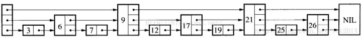

# 集合

## 无序集合

Redis通常使用字典结构保存用户集合数据, 字典键存储集合元素, 字典值为空. 如果一个集合全是整数, 则使用字典过于浪费内存, 为此, Redis设计了intset数据结构, 专门用来保存整数集合数据

## 有序集合

有序集合即数据都是有序的. 存储一组有序收据, 最简单的是一下两种结构:  
(1) 数据, 可以通过二分法查找数据, 但插入数据的复杂度为O(n)  
(2) 链表, 可以快速插入数据, 但无法使用二分查找, 查找数据的复杂度为O(n)  
兼具上面两种结构的优点的数据结构, **跳表skiplist**

### 定义
skiplist是一个多层级的链表结构

### 为什么使用skiplist

红黑树也常用于维护有序数据, 为什么使用skiplist

1. skiplist虽然以空间换时间, 但没有过度占用内存, 内存使用率在合理范围内
2. 有序集合常常需要执行ZRANGE或ZREVRANGE等遍历操作, 使用skiplist可以更高效地实现这些操作(skiplist第一层的双向链表可以遍历数据)
3. skiplist实现简单